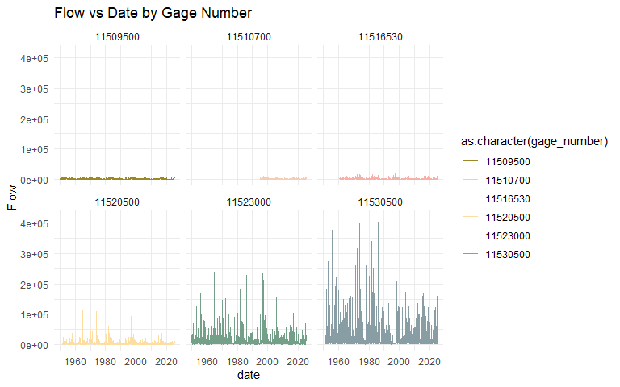
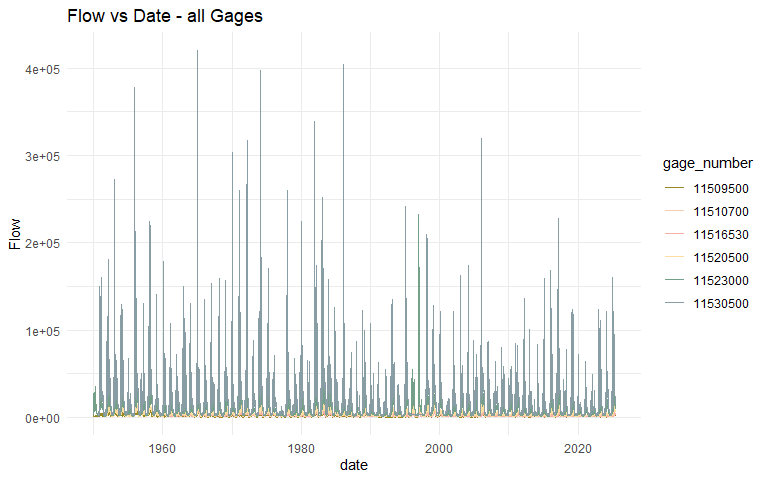
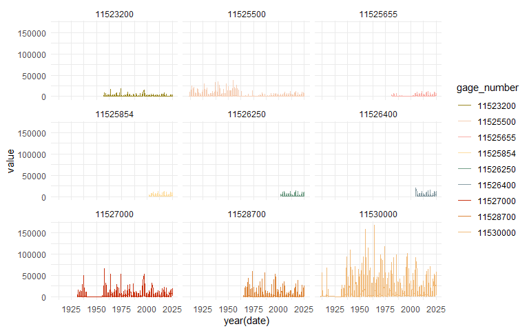
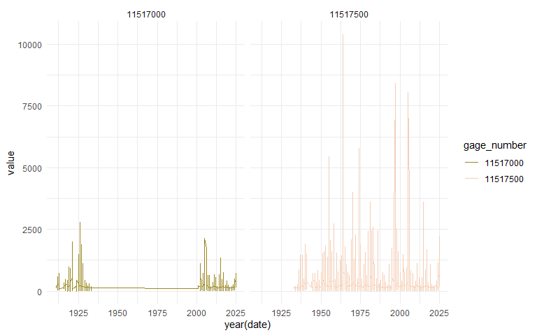
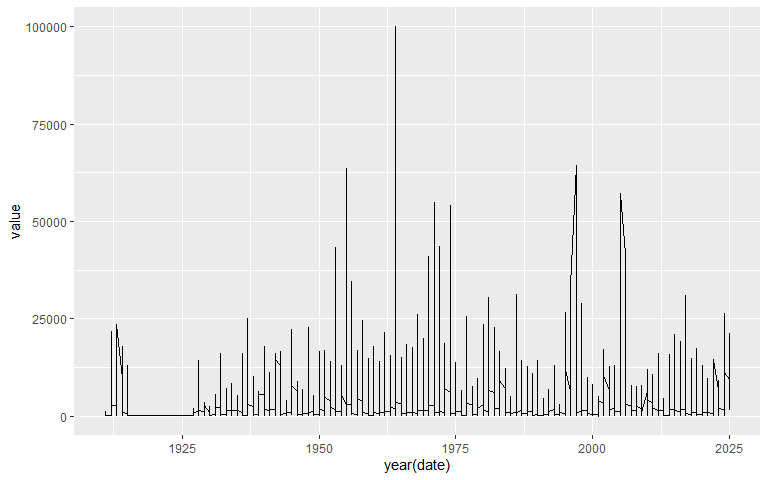
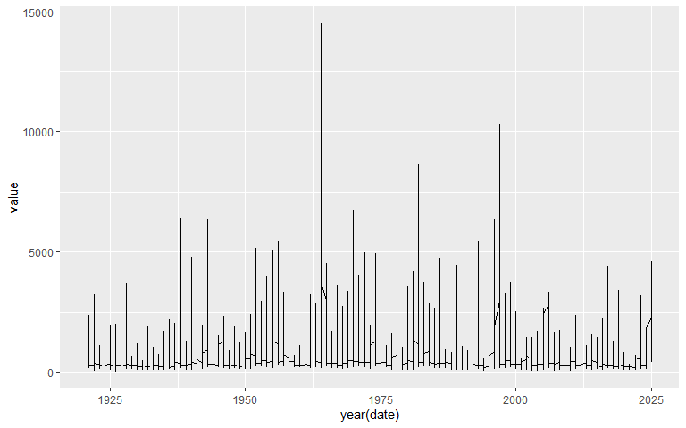
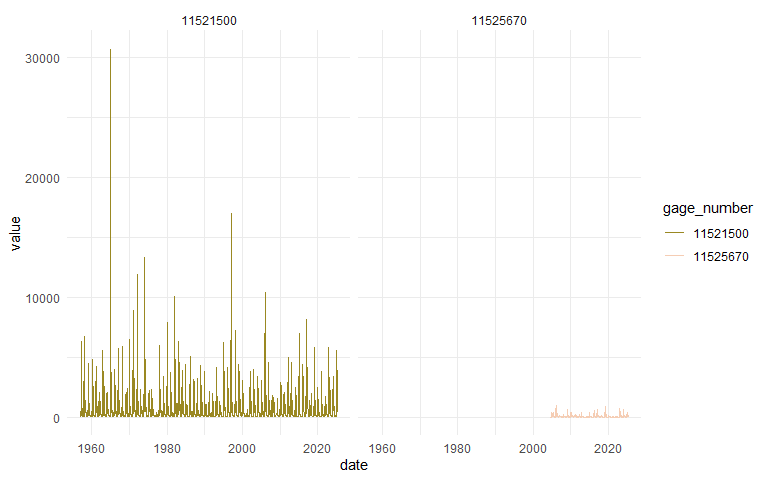
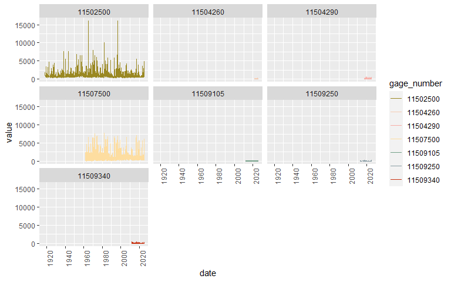

Klamath Basin Flow Gage Exploration
================
Badhia Yunes Katz - FlowWest

The goal of this markdown is to explore USGS gages within the Klamath
Basin, understand their geographic and temporal coverage.

USGS flow gage exploration - Klamath River Basin

## Pull Gage Data

## Main stream Klamath

- 11509500 - Klamath River at Keno Or
- 11510700 - Klamath River Below John C Boyle Powerplant
- 11516530 - Klamath River Below Iorngate Dam
- 11520500 - Klamath River Nr Seiad Valley CA
- 11523000 - Klamath River A Orleans
- 11530500 - Klamath River Near Klamath (Furthest Downstream)

### Date coverage

<!-- --><!-- -->

### Date range summary

    #> Rows: 6
    #> Columns: 4
    #> $ gage_number  <chr> "11509500", "11510700", "11516530", "11520500", "11523000…
    #> $ min_date     <date> 1950-01-01, 1995-01-01, 1960-10-01, 1951-10-01, 1950-01-…
    #> $ max_date     <date> 2025-05-18, 2025-05-18, 2025-05-18, 2025-05-18, 2025-05-…
    #> $ record_count <int> 27532, 11096, 23604, 26894, 27531, 26550

## Trinity

Potential gages

- 11528700 SF TRINITY R BL HYAMPOM CA - South fork
- 11530000 TRINITY R A HOOPA CA
- 11523200 TRINITY R AB COFFEE C NR TRINITY CENTER CA
- 11525500 TRINITY R A LEWISTON CA
- 11525655 TRINITY R BL LIMEKILN GULCH NR DOUGLAS CITY CA
- 11525854 TRINITY R A DOUGLAS CITY CA
- 11526250 TRINITY R A JUNCTION CITY CA
- 11526400 TRINITY R AB NF TRINITY R NR HELENA CA
- 11527000 TRINITY R NR BURNT RANCH CA

### Date coverage per gage

<!-- -->

### Date range summary

    #> Rows: 9
    #> Columns: 4
    #> $ gage_number  <chr> "11523200", "11525500", "11525655", "11525854", "11526250…
    #> $ min_date     <date> 1957-10-01, 1911-10-01, 1981-04-28, 2002-10-01, 2002-10-…
    #> $ max_date     <date> 2025-05-18, 2025-05-18, 2025-05-18, 2025-05-18, 2025-05-…
    #> $ record_count <int> 24692, 41502, 12068, 8266, 8266, 7356, 28354, 21780, 35658

## Scott

- 11519500 SCOTT R NR FORT JONES CA

## Shasta

- Shasta R NR Montague CA - 11517000
- Shasta R NR Yreka CA - 11517500

### Date coverage plot

<!-- -->

### Date range summary

    #> Rows: 2
    #> Columns: 4
    #> $ gage_number  <chr> "11517000", "11517500"
    #> $ min_date     <date> 1911-10-01, 1933-10-01
    #> $ max_date     <date> 2025-05-18, 2025-05-18
    #> $ record_count <int> 14838, 32390

## Salmon

- 11522500 SALMON R A SOMES BAR CA

### Date coverage plot

<!-- -->

    #> List of 97
    #>  $ line                      :List of 6
    #>   ..$ colour       : chr "black"
    #>   ..$ linewidth    : num 0.5
    #>   ..$ linetype     : num 1
    #>   ..$ lineend      : chr "butt"
    #>   ..$ arrow        : logi FALSE
    #>   ..$ inherit.blank: logi TRUE
    #>   ..- attr(*, "class")= chr [1:2] "element_line" "element"
    #>  $ rect                      :List of 5
    #>   ..$ fill         : chr "white"
    #>   ..$ colour       : chr "black"
    #>   ..$ linewidth    : num 0.5
    #>   ..$ linetype     : num 1
    #>   ..$ inherit.blank: logi TRUE
    #>   ..- attr(*, "class")= chr [1:2] "element_rect" "element"
    #>  $ text                      :List of 11
    #>   ..$ family       : chr ""
    #>   ..$ face         : chr "plain"
    #>   ..$ colour       : chr "black"
    #>   ..$ size         : num 11
    #>   ..$ hjust        : num 0.5
    #>   ..$ vjust        : num 0.5
    #>   ..$ angle        : num 0
    #>   ..$ lineheight   : num 0.9
    #>   ..$ margin       : 'margin' num [1:4] 0points 0points 0points 0points
    #>   .. ..- attr(*, "unit")= int 8
    #>   ..$ debug        : logi FALSE
    #>   ..$ inherit.blank: logi TRUE
    #>   ..- attr(*, "class")= chr [1:2] "element_text" "element"
    #>  $ title                     : NULL
    #>  $ aspect.ratio              : NULL
    #>  $ axis.title                : NULL
    #>  $ axis.title.x              :List of 11
    #>   ..$ family       : NULL
    #>   ..$ face         : NULL
    #>   ..$ colour       : NULL
    #>   ..$ size         : NULL
    #>   ..$ hjust        : NULL
    #>   ..$ vjust        : num 1
    #>   ..$ angle        : NULL
    #>   ..$ lineheight   : NULL
    #>   ..$ margin       : 'margin' num [1:4] 2.75points 0points 0points 0points
    #>   .. ..- attr(*, "unit")= int 8
    #>   ..$ debug        : NULL
    #>   ..$ inherit.blank: logi TRUE
    #>   ..- attr(*, "class")= chr [1:2] "element_text" "element"
    #>  $ axis.title.x.top          :List of 11
    #>   ..$ family       : NULL
    #>   ..$ face         : NULL
    #>   ..$ colour       : NULL
    #>   ..$ size         : NULL
    #>   ..$ hjust        : NULL
    #>   ..$ vjust        : num 0
    #>   ..$ angle        : NULL
    #>   ..$ lineheight   : NULL
    #>   ..$ margin       : 'margin' num [1:4] 0points 0points 2.75points 0points
    #>   .. ..- attr(*, "unit")= int 8
    #>   ..$ debug        : NULL
    #>   ..$ inherit.blank: logi TRUE
    #>   ..- attr(*, "class")= chr [1:2] "element_text" "element"
    #>  $ axis.title.x.bottom       : NULL
    #>  $ axis.title.y              :List of 11
    #>   ..$ family       : NULL
    #>   ..$ face         : NULL
    #>   ..$ colour       : NULL
    #>   ..$ size         : NULL
    #>   ..$ hjust        : NULL
    #>   ..$ vjust        : num 1
    #>   ..$ angle        : num 90
    #>   ..$ lineheight   : NULL
    #>   ..$ margin       : 'margin' num [1:4] 0points 2.75points 0points 0points
    #>   .. ..- attr(*, "unit")= int 8
    #>   ..$ debug        : NULL
    #>   ..$ inherit.blank: logi TRUE
    #>   ..- attr(*, "class")= chr [1:2] "element_text" "element"
    #>  $ axis.title.y.left         : NULL
    #>  $ axis.title.y.right        :List of 11
    #>   ..$ family       : NULL
    #>   ..$ face         : NULL
    #>   ..$ colour       : NULL
    #>   ..$ size         : NULL
    #>   ..$ hjust        : NULL
    #>   ..$ vjust        : num 0
    #>   ..$ angle        : num -90
    #>   ..$ lineheight   : NULL
    #>   ..$ margin       : 'margin' num [1:4] 0points 0points 0points 2.75points
    #>   .. ..- attr(*, "unit")= int 8
    #>   ..$ debug        : NULL
    #>   ..$ inherit.blank: logi TRUE
    #>   ..- attr(*, "class")= chr [1:2] "element_text" "element"
    #>  $ axis.text                 :List of 11
    #>   ..$ family       : NULL
    #>   ..$ face         : NULL
    #>   ..$ colour       : chr "grey30"
    #>   ..$ size         : 'rel' num 0.8
    #>   ..$ hjust        : NULL
    #>   ..$ vjust        : NULL
    #>   ..$ angle        : NULL
    #>   ..$ lineheight   : NULL
    #>   ..$ margin       : NULL
    #>   ..$ debug        : NULL
    #>   ..$ inherit.blank: logi TRUE
    #>   ..- attr(*, "class")= chr [1:2] "element_text" "element"
    #>  $ axis.text.x               :List of 11
    #>   ..$ family       : NULL
    #>   ..$ face         : NULL
    #>   ..$ colour       : NULL
    #>   ..$ size         : NULL
    #>   ..$ hjust        : NULL
    #>   ..$ vjust        : num 1
    #>   ..$ angle        : NULL
    #>   ..$ lineheight   : NULL
    #>   ..$ margin       : 'margin' num [1:4] 2.2points 0points 0points 0points
    #>   .. ..- attr(*, "unit")= int 8
    #>   ..$ debug        : NULL
    #>   ..$ inherit.blank: logi TRUE
    #>   ..- attr(*, "class")= chr [1:2] "element_text" "element"
    #>  $ axis.text.x.top           :List of 11
    #>   ..$ family       : NULL
    #>   ..$ face         : NULL
    #>   ..$ colour       : NULL
    #>   ..$ size         : NULL
    #>   ..$ hjust        : NULL
    #>   ..$ vjust        : num 0
    #>   ..$ angle        : NULL
    #>   ..$ lineheight   : NULL
    #>   ..$ margin       : 'margin' num [1:4] 0points 0points 2.2points 0points
    #>   .. ..- attr(*, "unit")= int 8
    #>   ..$ debug        : NULL
    #>   ..$ inherit.blank: logi TRUE
    #>   ..- attr(*, "class")= chr [1:2] "element_text" "element"
    #>  $ axis.text.x.bottom        : NULL
    #>  $ axis.text.y               :List of 11
    #>   ..$ family       : NULL
    #>   ..$ face         : NULL
    #>   ..$ colour       : NULL
    #>   ..$ size         : NULL
    #>   ..$ hjust        : num 1
    #>   ..$ vjust        : NULL
    #>   ..$ angle        : NULL
    #>   ..$ lineheight   : NULL
    #>   ..$ margin       : 'margin' num [1:4] 0points 2.2points 0points 0points
    #>   .. ..- attr(*, "unit")= int 8
    #>   ..$ debug        : NULL
    #>   ..$ inherit.blank: logi TRUE
    #>   ..- attr(*, "class")= chr [1:2] "element_text" "element"
    #>  $ axis.text.y.left          : NULL
    #>  $ axis.text.y.right         :List of 11
    #>   ..$ family       : NULL
    #>   ..$ face         : NULL
    #>   ..$ colour       : NULL
    #>   ..$ size         : NULL
    #>   ..$ hjust        : num 0
    #>   ..$ vjust        : NULL
    #>   ..$ angle        : NULL
    #>   ..$ lineheight   : NULL
    #>   ..$ margin       : 'margin' num [1:4] 0points 0points 0points 2.2points
    #>   .. ..- attr(*, "unit")= int 8
    #>   ..$ debug        : NULL
    #>   ..$ inherit.blank: logi TRUE
    #>   ..- attr(*, "class")= chr [1:2] "element_text" "element"
    #>  $ axis.ticks                : list()
    #>   ..- attr(*, "class")= chr [1:2] "element_blank" "element"
    #>  $ axis.ticks.x              : NULL
    #>  $ axis.ticks.x.top          : NULL
    #>  $ axis.ticks.x.bottom       : NULL
    #>  $ axis.ticks.y              : NULL
    #>  $ axis.ticks.y.left         : NULL
    #>  $ axis.ticks.y.right        : NULL
    #>  $ axis.ticks.length         : 'simpleUnit' num 2.75points
    #>   ..- attr(*, "unit")= int 8
    #>  $ axis.ticks.length.x       : NULL
    #>  $ axis.ticks.length.x.top   : NULL
    #>  $ axis.ticks.length.x.bottom: NULL
    #>  $ axis.ticks.length.y       : NULL
    #>  $ axis.ticks.length.y.left  : NULL
    #>  $ axis.ticks.length.y.right : NULL
    #>  $ axis.line                 : list()
    #>   ..- attr(*, "class")= chr [1:2] "element_blank" "element"
    #>  $ axis.line.x               : NULL
    #>  $ axis.line.x.top           : NULL
    #>  $ axis.line.x.bottom        : NULL
    #>  $ axis.line.y               : NULL
    #>  $ axis.line.y.left          : NULL
    #>  $ axis.line.y.right         : NULL
    #>  $ legend.background         : list()
    #>   ..- attr(*, "class")= chr [1:2] "element_blank" "element"
    #>  $ legend.margin             : 'margin' num [1:4] 5.5points 5.5points 5.5points 5.5points
    #>   ..- attr(*, "unit")= int 8
    #>  $ legend.spacing            : 'simpleUnit' num 11points
    #>   ..- attr(*, "unit")= int 8
    #>  $ legend.spacing.x          : NULL
    #>  $ legend.spacing.y          : NULL
    #>  $ legend.key                : list()
    #>   ..- attr(*, "class")= chr [1:2] "element_blank" "element"
    #>  $ legend.key.size           : 'simpleUnit' num 1.2lines
    #>   ..- attr(*, "unit")= int 3
    #>  $ legend.key.height         : NULL
    #>  $ legend.key.width          : NULL
    #>  $ legend.text               :List of 11
    #>   ..$ family       : NULL
    #>   ..$ face         : NULL
    #>   ..$ colour       : NULL
    #>   ..$ size         : 'rel' num 0.8
    #>   ..$ hjust        : NULL
    #>   ..$ vjust        : NULL
    #>   ..$ angle        : NULL
    #>   ..$ lineheight   : NULL
    #>   ..$ margin       : NULL
    #>   ..$ debug        : NULL
    #>   ..$ inherit.blank: logi TRUE
    #>   ..- attr(*, "class")= chr [1:2] "element_text" "element"
    #>  $ legend.text.align         : NULL
    #>  $ legend.title              :List of 11
    #>   ..$ family       : NULL
    #>   ..$ face         : NULL
    #>   ..$ colour       : NULL
    #>   ..$ size         : NULL
    #>   ..$ hjust        : num 0
    #>   ..$ vjust        : NULL
    #>   ..$ angle        : NULL
    #>   ..$ lineheight   : NULL
    #>   ..$ margin       : NULL
    #>   ..$ debug        : NULL
    #>   ..$ inherit.blank: logi TRUE
    #>   ..- attr(*, "class")= chr [1:2] "element_text" "element"
    #>  $ legend.title.align        : NULL
    #>  $ legend.position           : chr "right"
    #>  $ legend.direction          : NULL
    #>  $ legend.justification      : chr "center"
    #>  $ legend.box                : NULL
    #>  $ legend.box.just           : NULL
    #>  $ legend.box.margin         : 'margin' num [1:4] 0cm 0cm 0cm 0cm
    #>   ..- attr(*, "unit")= int 1
    #>  $ legend.box.background     : list()
    #>   ..- attr(*, "class")= chr [1:2] "element_blank" "element"
    #>  $ legend.box.spacing        : 'simpleUnit' num 11points
    #>   ..- attr(*, "unit")= int 8
    #>  $ panel.background          : list()
    #>   ..- attr(*, "class")= chr [1:2] "element_blank" "element"
    #>  $ panel.border              : list()
    #>   ..- attr(*, "class")= chr [1:2] "element_blank" "element"
    #>  $ panel.spacing             : 'simpleUnit' num 5.5points
    #>   ..- attr(*, "unit")= int 8
    #>  $ panel.spacing.x           : NULL
    #>  $ panel.spacing.y           : NULL
    #>  $ panel.grid                :List of 6
    #>   ..$ colour       : chr "grey92"
    #>   ..$ linewidth    : NULL
    #>   ..$ linetype     : NULL
    #>   ..$ lineend      : NULL
    #>   ..$ arrow        : logi FALSE
    #>   ..$ inherit.blank: logi TRUE
    #>   ..- attr(*, "class")= chr [1:2] "element_line" "element"
    #>  $ panel.grid.major          : NULL
    #>  $ panel.grid.minor          :List of 6
    #>   ..$ colour       : NULL
    #>   ..$ linewidth    : 'rel' num 0.5
    #>   ..$ linetype     : NULL
    #>   ..$ lineend      : NULL
    #>   ..$ arrow        : logi FALSE
    #>   ..$ inherit.blank: logi TRUE
    #>   ..- attr(*, "class")= chr [1:2] "element_line" "element"
    #>  $ panel.grid.major.x        : NULL
    #>  $ panel.grid.major.y        : NULL
    #>  $ panel.grid.minor.x        : NULL
    #>  $ panel.grid.minor.y        : NULL
    #>  $ panel.ontop               : logi FALSE
    #>  $ plot.background           : list()
    #>   ..- attr(*, "class")= chr [1:2] "element_blank" "element"
    #>  $ plot.title                :List of 11
    #>   ..$ family       : NULL
    #>   ..$ face         : NULL
    #>   ..$ colour       : NULL
    #>   ..$ size         : 'rel' num 1.2
    #>   ..$ hjust        : num 0
    #>   ..$ vjust        : num 1
    #>   ..$ angle        : NULL
    #>   ..$ lineheight   : NULL
    #>   ..$ margin       : 'margin' num [1:4] 0points 0points 5.5points 0points
    #>   .. ..- attr(*, "unit")= int 8
    #>   ..$ debug        : NULL
    #>   ..$ inherit.blank: logi TRUE
    #>   ..- attr(*, "class")= chr [1:2] "element_text" "element"
    #>  $ plot.title.position       : chr "panel"
    #>  $ plot.subtitle             :List of 11
    #>   ..$ family       : NULL
    #>   ..$ face         : NULL
    #>   ..$ colour       : NULL
    #>   ..$ size         : NULL
    #>   ..$ hjust        : num 0
    #>   ..$ vjust        : num 1
    #>   ..$ angle        : NULL
    #>   ..$ lineheight   : NULL
    #>   ..$ margin       : 'margin' num [1:4] 0points 0points 5.5points 0points
    #>   .. ..- attr(*, "unit")= int 8
    #>   ..$ debug        : NULL
    #>   ..$ inherit.blank: logi TRUE
    #>   ..- attr(*, "class")= chr [1:2] "element_text" "element"
    #>  $ plot.caption              :List of 11
    #>   ..$ family       : NULL
    #>   ..$ face         : NULL
    #>   ..$ colour       : NULL
    #>   ..$ size         : 'rel' num 0.8
    #>   ..$ hjust        : num 1
    #>   ..$ vjust        : num 1
    #>   ..$ angle        : NULL
    #>   ..$ lineheight   : NULL
    #>   ..$ margin       : 'margin' num [1:4] 5.5points 0points 0points 0points
    #>   .. ..- attr(*, "unit")= int 8
    #>   ..$ debug        : NULL
    #>   ..$ inherit.blank: logi TRUE
    #>   ..- attr(*, "class")= chr [1:2] "element_text" "element"
    #>  $ plot.caption.position     : chr "panel"
    #>  $ plot.tag                  :List of 11
    #>   ..$ family       : NULL
    #>   ..$ face         : NULL
    #>   ..$ colour       : NULL
    #>   ..$ size         : 'rel' num 1.2
    #>   ..$ hjust        : num 0.5
    #>   ..$ vjust        : num 0.5
    #>   ..$ angle        : NULL
    #>   ..$ lineheight   : NULL
    #>   ..$ margin       : NULL
    #>   ..$ debug        : NULL
    #>   ..$ inherit.blank: logi TRUE
    #>   ..- attr(*, "class")= chr [1:2] "element_text" "element"
    #>  $ plot.tag.position         : chr "topleft"
    #>  $ plot.margin               : 'margin' num [1:4] 5.5points 5.5points 5.5points 5.5points
    #>   ..- attr(*, "unit")= int 8
    #>  $ strip.background          : list()
    #>   ..- attr(*, "class")= chr [1:2] "element_blank" "element"
    #>  $ strip.background.x        : NULL
    #>  $ strip.background.y        : NULL
    #>  $ strip.clip                : chr "inherit"
    #>  $ strip.placement           : chr "inside"
    #>  $ strip.text                :List of 11
    #>   ..$ family       : NULL
    #>   ..$ face         : NULL
    #>   ..$ colour       : chr "grey10"
    #>   ..$ size         : 'rel' num 0.8
    #>   ..$ hjust        : NULL
    #>   ..$ vjust        : NULL
    #>   ..$ angle        : NULL
    #>   ..$ lineheight   : NULL
    #>   ..$ margin       : 'margin' num [1:4] 4.4points 4.4points 4.4points 4.4points
    #>   .. ..- attr(*, "unit")= int 8
    #>   ..$ debug        : NULL
    #>   ..$ inherit.blank: logi TRUE
    #>   ..- attr(*, "class")= chr [1:2] "element_text" "element"
    #>  $ strip.text.x              : NULL
    #>  $ strip.text.x.bottom       : NULL
    #>  $ strip.text.x.top          : NULL
    #>  $ strip.text.y              :List of 11
    #>   ..$ family       : NULL
    #>   ..$ face         : NULL
    #>   ..$ colour       : NULL
    #>   ..$ size         : NULL
    #>   ..$ hjust        : NULL
    #>   ..$ vjust        : NULL
    #>   ..$ angle        : num -90
    #>   ..$ lineheight   : NULL
    #>   ..$ margin       : NULL
    #>   ..$ debug        : NULL
    #>   ..$ inherit.blank: logi TRUE
    #>   ..- attr(*, "class")= chr [1:2] "element_text" "element"
    #>  $ strip.text.y.left         :List of 11
    #>   ..$ family       : NULL
    #>   ..$ face         : NULL
    #>   ..$ colour       : NULL
    #>   ..$ size         : NULL
    #>   ..$ hjust        : NULL
    #>   ..$ vjust        : NULL
    #>   ..$ angle        : num 90
    #>   ..$ lineheight   : NULL
    #>   ..$ margin       : NULL
    #>   ..$ debug        : NULL
    #>   ..$ inherit.blank: logi TRUE
    #>   ..- attr(*, "class")= chr [1:2] "element_text" "element"
    #>  $ strip.text.y.right        : NULL
    #>  $ strip.switch.pad.grid     : 'simpleUnit' num 2.75points
    #>   ..- attr(*, "unit")= int 8
    #>  $ strip.switch.pad.wrap     : 'simpleUnit' num 2.75points
    #>   ..- attr(*, "unit")= int 8
    #>  - attr(*, "class")= chr [1:2] "theme" "gg"
    #>  - attr(*, "complete")= logi TRUE
    #>  - attr(*, "validate")= logi TRUE

### Date range summary

    #> Rows: 1
    #> Columns: 4
    #> $ gage_number  <chr> "11522500"
    #> $ min_date     <date> 1911-10-01
    #> $ max_date     <date> 2025-05-18
    #> $ record_count <int> 37120

## Sprague

- Sprague River Near Chiloquin, OR - 11501000

### Date coverage plot

<!-- -->

    #> List of 97
    #>  $ line                      :List of 6
    #>   ..$ colour       : chr "black"
    #>   ..$ linewidth    : num 0.5
    #>   ..$ linetype     : num 1
    #>   ..$ lineend      : chr "butt"
    #>   ..$ arrow        : logi FALSE
    #>   ..$ inherit.blank: logi TRUE
    #>   ..- attr(*, "class")= chr [1:2] "element_line" "element"
    #>  $ rect                      :List of 5
    #>   ..$ fill         : chr "white"
    #>   ..$ colour       : chr "black"
    #>   ..$ linewidth    : num 0.5
    #>   ..$ linetype     : num 1
    #>   ..$ inherit.blank: logi TRUE
    #>   ..- attr(*, "class")= chr [1:2] "element_rect" "element"
    #>  $ text                      :List of 11
    #>   ..$ family       : chr ""
    #>   ..$ face         : chr "plain"
    #>   ..$ colour       : chr "black"
    #>   ..$ size         : num 11
    #>   ..$ hjust        : num 0.5
    #>   ..$ vjust        : num 0.5
    #>   ..$ angle        : num 0
    #>   ..$ lineheight   : num 0.9
    #>   ..$ margin       : 'margin' num [1:4] 0points 0points 0points 0points
    #>   .. ..- attr(*, "unit")= int 8
    #>   ..$ debug        : logi FALSE
    #>   ..$ inherit.blank: logi TRUE
    #>   ..- attr(*, "class")= chr [1:2] "element_text" "element"
    #>  $ title                     : NULL
    #>  $ aspect.ratio              : NULL
    #>  $ axis.title                : NULL
    #>  $ axis.title.x              :List of 11
    #>   ..$ family       : NULL
    #>   ..$ face         : NULL
    #>   ..$ colour       : NULL
    #>   ..$ size         : NULL
    #>   ..$ hjust        : NULL
    #>   ..$ vjust        : num 1
    #>   ..$ angle        : NULL
    #>   ..$ lineheight   : NULL
    #>   ..$ margin       : 'margin' num [1:4] 2.75points 0points 0points 0points
    #>   .. ..- attr(*, "unit")= int 8
    #>   ..$ debug        : NULL
    #>   ..$ inherit.blank: logi TRUE
    #>   ..- attr(*, "class")= chr [1:2] "element_text" "element"
    #>  $ axis.title.x.top          :List of 11
    #>   ..$ family       : NULL
    #>   ..$ face         : NULL
    #>   ..$ colour       : NULL
    #>   ..$ size         : NULL
    #>   ..$ hjust        : NULL
    #>   ..$ vjust        : num 0
    #>   ..$ angle        : NULL
    #>   ..$ lineheight   : NULL
    #>   ..$ margin       : 'margin' num [1:4] 0points 0points 2.75points 0points
    #>   .. ..- attr(*, "unit")= int 8
    #>   ..$ debug        : NULL
    #>   ..$ inherit.blank: logi TRUE
    #>   ..- attr(*, "class")= chr [1:2] "element_text" "element"
    #>  $ axis.title.x.bottom       : NULL
    #>  $ axis.title.y              :List of 11
    #>   ..$ family       : NULL
    #>   ..$ face         : NULL
    #>   ..$ colour       : NULL
    #>   ..$ size         : NULL
    #>   ..$ hjust        : NULL
    #>   ..$ vjust        : num 1
    #>   ..$ angle        : num 90
    #>   ..$ lineheight   : NULL
    #>   ..$ margin       : 'margin' num [1:4] 0points 2.75points 0points 0points
    #>   .. ..- attr(*, "unit")= int 8
    #>   ..$ debug        : NULL
    #>   ..$ inherit.blank: logi TRUE
    #>   ..- attr(*, "class")= chr [1:2] "element_text" "element"
    #>  $ axis.title.y.left         : NULL
    #>  $ axis.title.y.right        :List of 11
    #>   ..$ family       : NULL
    #>   ..$ face         : NULL
    #>   ..$ colour       : NULL
    #>   ..$ size         : NULL
    #>   ..$ hjust        : NULL
    #>   ..$ vjust        : num 0
    #>   ..$ angle        : num -90
    #>   ..$ lineheight   : NULL
    #>   ..$ margin       : 'margin' num [1:4] 0points 0points 0points 2.75points
    #>   .. ..- attr(*, "unit")= int 8
    #>   ..$ debug        : NULL
    #>   ..$ inherit.blank: logi TRUE
    #>   ..- attr(*, "class")= chr [1:2] "element_text" "element"
    #>  $ axis.text                 :List of 11
    #>   ..$ family       : NULL
    #>   ..$ face         : NULL
    #>   ..$ colour       : chr "grey30"
    #>   ..$ size         : 'rel' num 0.8
    #>   ..$ hjust        : NULL
    #>   ..$ vjust        : NULL
    #>   ..$ angle        : NULL
    #>   ..$ lineheight   : NULL
    #>   ..$ margin       : NULL
    #>   ..$ debug        : NULL
    #>   ..$ inherit.blank: logi TRUE
    #>   ..- attr(*, "class")= chr [1:2] "element_text" "element"
    #>  $ axis.text.x               :List of 11
    #>   ..$ family       : NULL
    #>   ..$ face         : NULL
    #>   ..$ colour       : NULL
    #>   ..$ size         : NULL
    #>   ..$ hjust        : NULL
    #>   ..$ vjust        : num 1
    #>   ..$ angle        : NULL
    #>   ..$ lineheight   : NULL
    #>   ..$ margin       : 'margin' num [1:4] 2.2points 0points 0points 0points
    #>   .. ..- attr(*, "unit")= int 8
    #>   ..$ debug        : NULL
    #>   ..$ inherit.blank: logi TRUE
    #>   ..- attr(*, "class")= chr [1:2] "element_text" "element"
    #>  $ axis.text.x.top           :List of 11
    #>   ..$ family       : NULL
    #>   ..$ face         : NULL
    #>   ..$ colour       : NULL
    #>   ..$ size         : NULL
    #>   ..$ hjust        : NULL
    #>   ..$ vjust        : num 0
    #>   ..$ angle        : NULL
    #>   ..$ lineheight   : NULL
    #>   ..$ margin       : 'margin' num [1:4] 0points 0points 2.2points 0points
    #>   .. ..- attr(*, "unit")= int 8
    #>   ..$ debug        : NULL
    #>   ..$ inherit.blank: logi TRUE
    #>   ..- attr(*, "class")= chr [1:2] "element_text" "element"
    #>  $ axis.text.x.bottom        : NULL
    #>  $ axis.text.y               :List of 11
    #>   ..$ family       : NULL
    #>   ..$ face         : NULL
    #>   ..$ colour       : NULL
    #>   ..$ size         : NULL
    #>   ..$ hjust        : num 1
    #>   ..$ vjust        : NULL
    #>   ..$ angle        : NULL
    #>   ..$ lineheight   : NULL
    #>   ..$ margin       : 'margin' num [1:4] 0points 2.2points 0points 0points
    #>   .. ..- attr(*, "unit")= int 8
    #>   ..$ debug        : NULL
    #>   ..$ inherit.blank: logi TRUE
    #>   ..- attr(*, "class")= chr [1:2] "element_text" "element"
    #>  $ axis.text.y.left          : NULL
    #>  $ axis.text.y.right         :List of 11
    #>   ..$ family       : NULL
    #>   ..$ face         : NULL
    #>   ..$ colour       : NULL
    #>   ..$ size         : NULL
    #>   ..$ hjust        : num 0
    #>   ..$ vjust        : NULL
    #>   ..$ angle        : NULL
    #>   ..$ lineheight   : NULL
    #>   ..$ margin       : 'margin' num [1:4] 0points 0points 0points 2.2points
    #>   .. ..- attr(*, "unit")= int 8
    #>   ..$ debug        : NULL
    #>   ..$ inherit.blank: logi TRUE
    #>   ..- attr(*, "class")= chr [1:2] "element_text" "element"
    #>  $ axis.ticks                : list()
    #>   ..- attr(*, "class")= chr [1:2] "element_blank" "element"
    #>  $ axis.ticks.x              : NULL
    #>  $ axis.ticks.x.top          : NULL
    #>  $ axis.ticks.x.bottom       : NULL
    #>  $ axis.ticks.y              : NULL
    #>  $ axis.ticks.y.left         : NULL
    #>  $ axis.ticks.y.right        : NULL
    #>  $ axis.ticks.length         : 'simpleUnit' num 2.75points
    #>   ..- attr(*, "unit")= int 8
    #>  $ axis.ticks.length.x       : NULL
    #>  $ axis.ticks.length.x.top   : NULL
    #>  $ axis.ticks.length.x.bottom: NULL
    #>  $ axis.ticks.length.y       : NULL
    #>  $ axis.ticks.length.y.left  : NULL
    #>  $ axis.ticks.length.y.right : NULL
    #>  $ axis.line                 : list()
    #>   ..- attr(*, "class")= chr [1:2] "element_blank" "element"
    #>  $ axis.line.x               : NULL
    #>  $ axis.line.x.top           : NULL
    #>  $ axis.line.x.bottom        : NULL
    #>  $ axis.line.y               : NULL
    #>  $ axis.line.y.left          : NULL
    #>  $ axis.line.y.right         : NULL
    #>  $ legend.background         : list()
    #>   ..- attr(*, "class")= chr [1:2] "element_blank" "element"
    #>  $ legend.margin             : 'margin' num [1:4] 5.5points 5.5points 5.5points 5.5points
    #>   ..- attr(*, "unit")= int 8
    #>  $ legend.spacing            : 'simpleUnit' num 11points
    #>   ..- attr(*, "unit")= int 8
    #>  $ legend.spacing.x          : NULL
    #>  $ legend.spacing.y          : NULL
    #>  $ legend.key                : list()
    #>   ..- attr(*, "class")= chr [1:2] "element_blank" "element"
    #>  $ legend.key.size           : 'simpleUnit' num 1.2lines
    #>   ..- attr(*, "unit")= int 3
    #>  $ legend.key.height         : NULL
    #>  $ legend.key.width          : NULL
    #>  $ legend.text               :List of 11
    #>   ..$ family       : NULL
    #>   ..$ face         : NULL
    #>   ..$ colour       : NULL
    #>   ..$ size         : 'rel' num 0.8
    #>   ..$ hjust        : NULL
    #>   ..$ vjust        : NULL
    #>   ..$ angle        : NULL
    #>   ..$ lineheight   : NULL
    #>   ..$ margin       : NULL
    #>   ..$ debug        : NULL
    #>   ..$ inherit.blank: logi TRUE
    #>   ..- attr(*, "class")= chr [1:2] "element_text" "element"
    #>  $ legend.text.align         : NULL
    #>  $ legend.title              :List of 11
    #>   ..$ family       : NULL
    #>   ..$ face         : NULL
    #>   ..$ colour       : NULL
    #>   ..$ size         : NULL
    #>   ..$ hjust        : num 0
    #>   ..$ vjust        : NULL
    #>   ..$ angle        : NULL
    #>   ..$ lineheight   : NULL
    #>   ..$ margin       : NULL
    #>   ..$ debug        : NULL
    #>   ..$ inherit.blank: logi TRUE
    #>   ..- attr(*, "class")= chr [1:2] "element_text" "element"
    #>  $ legend.title.align        : NULL
    #>  $ legend.position           : chr "right"
    #>  $ legend.direction          : NULL
    #>  $ legend.justification      : chr "center"
    #>  $ legend.box                : NULL
    #>  $ legend.box.just           : NULL
    #>  $ legend.box.margin         : 'margin' num [1:4] 0cm 0cm 0cm 0cm
    #>   ..- attr(*, "unit")= int 1
    #>  $ legend.box.background     : list()
    #>   ..- attr(*, "class")= chr [1:2] "element_blank" "element"
    #>  $ legend.box.spacing        : 'simpleUnit' num 11points
    #>   ..- attr(*, "unit")= int 8
    #>  $ panel.background          : list()
    #>   ..- attr(*, "class")= chr [1:2] "element_blank" "element"
    #>  $ panel.border              : list()
    #>   ..- attr(*, "class")= chr [1:2] "element_blank" "element"
    #>  $ panel.spacing             : 'simpleUnit' num 5.5points
    #>   ..- attr(*, "unit")= int 8
    #>  $ panel.spacing.x           : NULL
    #>  $ panel.spacing.y           : NULL
    #>  $ panel.grid                :List of 6
    #>   ..$ colour       : chr "grey92"
    #>   ..$ linewidth    : NULL
    #>   ..$ linetype     : NULL
    #>   ..$ lineend      : NULL
    #>   ..$ arrow        : logi FALSE
    #>   ..$ inherit.blank: logi TRUE
    #>   ..- attr(*, "class")= chr [1:2] "element_line" "element"
    #>  $ panel.grid.major          : NULL
    #>  $ panel.grid.minor          :List of 6
    #>   ..$ colour       : NULL
    #>   ..$ linewidth    : 'rel' num 0.5
    #>   ..$ linetype     : NULL
    #>   ..$ lineend      : NULL
    #>   ..$ arrow        : logi FALSE
    #>   ..$ inherit.blank: logi TRUE
    #>   ..- attr(*, "class")= chr [1:2] "element_line" "element"
    #>  $ panel.grid.major.x        : NULL
    #>  $ panel.grid.major.y        : NULL
    #>  $ panel.grid.minor.x        : NULL
    #>  $ panel.grid.minor.y        : NULL
    #>  $ panel.ontop               : logi FALSE
    #>  $ plot.background           : list()
    #>   ..- attr(*, "class")= chr [1:2] "element_blank" "element"
    #>  $ plot.title                :List of 11
    #>   ..$ family       : NULL
    #>   ..$ face         : NULL
    #>   ..$ colour       : NULL
    #>   ..$ size         : 'rel' num 1.2
    #>   ..$ hjust        : num 0
    #>   ..$ vjust        : num 1
    #>   ..$ angle        : NULL
    #>   ..$ lineheight   : NULL
    #>   ..$ margin       : 'margin' num [1:4] 0points 0points 5.5points 0points
    #>   .. ..- attr(*, "unit")= int 8
    #>   ..$ debug        : NULL
    #>   ..$ inherit.blank: logi TRUE
    #>   ..- attr(*, "class")= chr [1:2] "element_text" "element"
    #>  $ plot.title.position       : chr "panel"
    #>  $ plot.subtitle             :List of 11
    #>   ..$ family       : NULL
    #>   ..$ face         : NULL
    #>   ..$ colour       : NULL
    #>   ..$ size         : NULL
    #>   ..$ hjust        : num 0
    #>   ..$ vjust        : num 1
    #>   ..$ angle        : NULL
    #>   ..$ lineheight   : NULL
    #>   ..$ margin       : 'margin' num [1:4] 0points 0points 5.5points 0points
    #>   .. ..- attr(*, "unit")= int 8
    #>   ..$ debug        : NULL
    #>   ..$ inherit.blank: logi TRUE
    #>   ..- attr(*, "class")= chr [1:2] "element_text" "element"
    #>  $ plot.caption              :List of 11
    #>   ..$ family       : NULL
    #>   ..$ face         : NULL
    #>   ..$ colour       : NULL
    #>   ..$ size         : 'rel' num 0.8
    #>   ..$ hjust        : num 1
    #>   ..$ vjust        : num 1
    #>   ..$ angle        : NULL
    #>   ..$ lineheight   : NULL
    #>   ..$ margin       : 'margin' num [1:4] 5.5points 0points 0points 0points
    #>   .. ..- attr(*, "unit")= int 8
    #>   ..$ debug        : NULL
    #>   ..$ inherit.blank: logi TRUE
    #>   ..- attr(*, "class")= chr [1:2] "element_text" "element"
    #>  $ plot.caption.position     : chr "panel"
    #>  $ plot.tag                  :List of 11
    #>   ..$ family       : NULL
    #>   ..$ face         : NULL
    #>   ..$ colour       : NULL
    #>   ..$ size         : 'rel' num 1.2
    #>   ..$ hjust        : num 0.5
    #>   ..$ vjust        : num 0.5
    #>   ..$ angle        : NULL
    #>   ..$ lineheight   : NULL
    #>   ..$ margin       : NULL
    #>   ..$ debug        : NULL
    #>   ..$ inherit.blank: logi TRUE
    #>   ..- attr(*, "class")= chr [1:2] "element_text" "element"
    #>  $ plot.tag.position         : chr "topleft"
    #>  $ plot.margin               : 'margin' num [1:4] 5.5points 5.5points 5.5points 5.5points
    #>   ..- attr(*, "unit")= int 8
    #>  $ strip.background          : list()
    #>   ..- attr(*, "class")= chr [1:2] "element_blank" "element"
    #>  $ strip.background.x        : NULL
    #>  $ strip.background.y        : NULL
    #>  $ strip.clip                : chr "inherit"
    #>  $ strip.placement           : chr "inside"
    #>  $ strip.text                :List of 11
    #>   ..$ family       : NULL
    #>   ..$ face         : NULL
    #>   ..$ colour       : chr "grey10"
    #>   ..$ size         : 'rel' num 0.8
    #>   ..$ hjust        : NULL
    #>   ..$ vjust        : NULL
    #>   ..$ angle        : NULL
    #>   ..$ lineheight   : NULL
    #>   ..$ margin       : 'margin' num [1:4] 4.4points 4.4points 4.4points 4.4points
    #>   .. ..- attr(*, "unit")= int 8
    #>   ..$ debug        : NULL
    #>   ..$ inherit.blank: logi TRUE
    #>   ..- attr(*, "class")= chr [1:2] "element_text" "element"
    #>  $ strip.text.x              : NULL
    #>  $ strip.text.x.bottom       : NULL
    #>  $ strip.text.x.top          : NULL
    #>  $ strip.text.y              :List of 11
    #>   ..$ family       : NULL
    #>   ..$ face         : NULL
    #>   ..$ colour       : NULL
    #>   ..$ size         : NULL
    #>   ..$ hjust        : NULL
    #>   ..$ vjust        : NULL
    #>   ..$ angle        : num -90
    #>   ..$ lineheight   : NULL
    #>   ..$ margin       : NULL
    #>   ..$ debug        : NULL
    #>   ..$ inherit.blank: logi TRUE
    #>   ..- attr(*, "class")= chr [1:2] "element_text" "element"
    #>  $ strip.text.y.left         :List of 11
    #>   ..$ family       : NULL
    #>   ..$ face         : NULL
    #>   ..$ colour       : NULL
    #>   ..$ size         : NULL
    #>   ..$ hjust        : NULL
    #>   ..$ vjust        : NULL
    #>   ..$ angle        : num 90
    #>   ..$ lineheight   : NULL
    #>   ..$ margin       : NULL
    #>   ..$ debug        : NULL
    #>   ..$ inherit.blank: logi TRUE
    #>   ..- attr(*, "class")= chr [1:2] "element_text" "element"
    #>  $ strip.text.y.right        : NULL
    #>  $ strip.switch.pad.grid     : 'simpleUnit' num 2.75points
    #>   ..- attr(*, "unit")= int 8
    #>  $ strip.switch.pad.wrap     : 'simpleUnit' num 2.75points
    #>   ..- attr(*, "unit")= int 8
    #>  - attr(*, "class")= chr [1:2] "theme" "gg"
    #>  - attr(*, "complete")= logi TRUE
    #>  - attr(*, "validate")= logi TRUE

### Date range summary

    #> Rows: 1
    #> Columns: 4
    #> $ gage_number  <chr> "11501000"
    #> $ min_date     <date> 1921-03-01
    #> $ max_date     <date> 2025-05-18
    #> $ record_count <int> 38046

## Indian Creek

List of USGS gages in Klamath watershed:

- Indian C NR Douglas City CA - 11525670
- Indian C NR Happy Camp CA - 11521500

### Date coverage

<!-- -->

## Other streams - Oregon

- Klamath Straits Drain Near Worden, OR - 11509340
- Ady Canal Above Lower Klamath Nwr, Near Worden, OR - 11509250
- North Canal at Highway 97, Near Midland, OR - 11509105
- Link River at Klamath Falls, OR - 11507500
- Williamson River Blw Sprague River NR Chiloquin,or - 11502500
- Crystal Creek Near Rocky Point, OR - 11504270 - NODATA
- Fourmile Canal Near Klamath Agency, OR - 11504260
- Sevenmile Cnl at Dike RD Br, NR Klamath Agency, OR - 11504290

### Date coverage

<!-- -->

### Date range summary

    #> Rows: 7
    #> Columns: 4
    #> $ gage_number  <chr> "11502500", "11504260", "11504290", "11507500", "11509105…
    #> $ min_date     <date> 1917-10-01, 2021-08-05, 2017-05-04, 1961-10-01, 2012-02-…
    #> $ max_date     <date> 2025-05-18, 2025-05-18, 2025-05-18, 2025-05-18, 2025-05-…
    #> $ record_count <int> 38978, 1382, 2937, 23241, 4828, 4609, 4922
