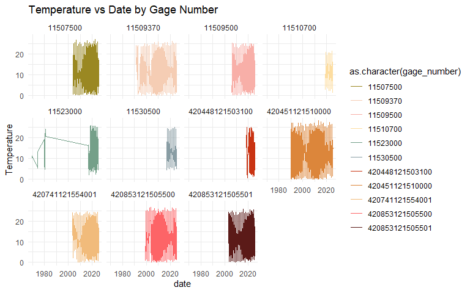
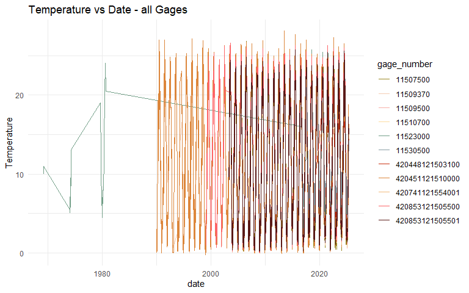
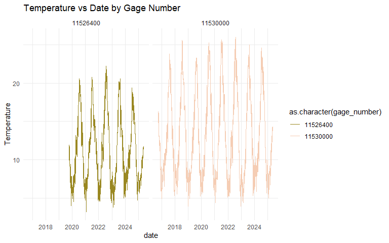
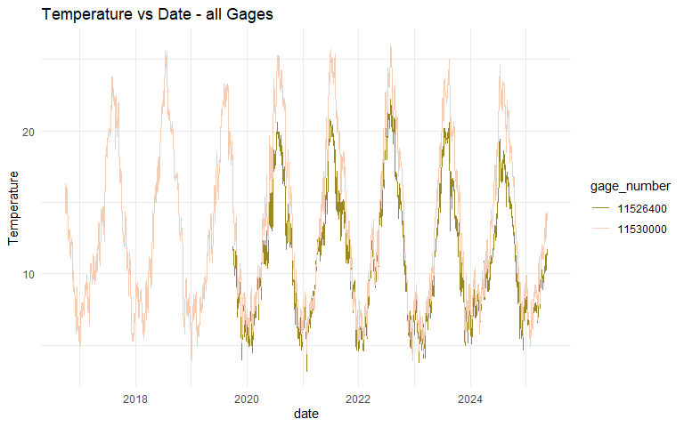
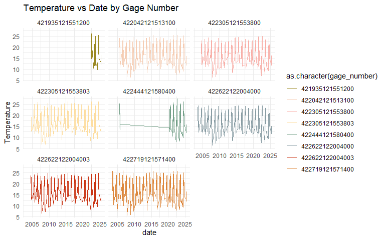
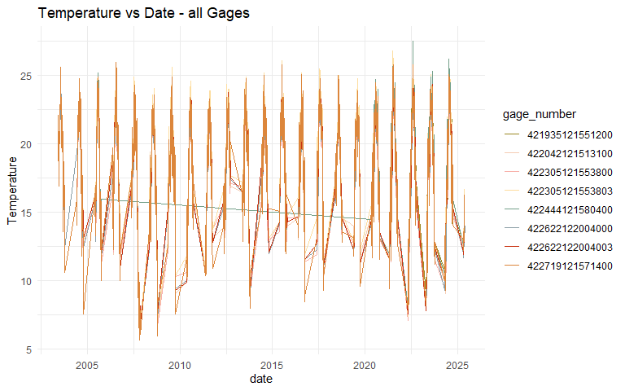
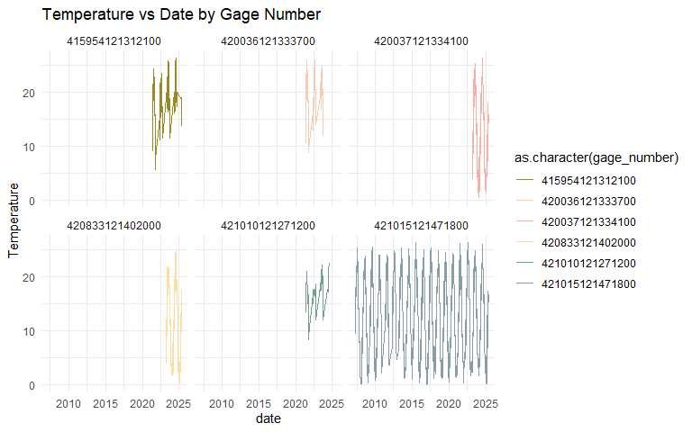
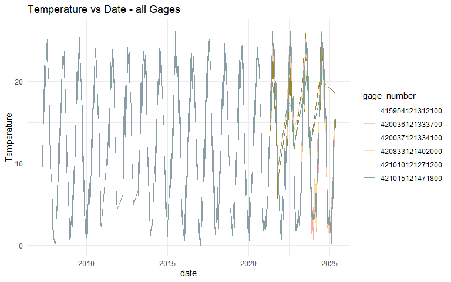
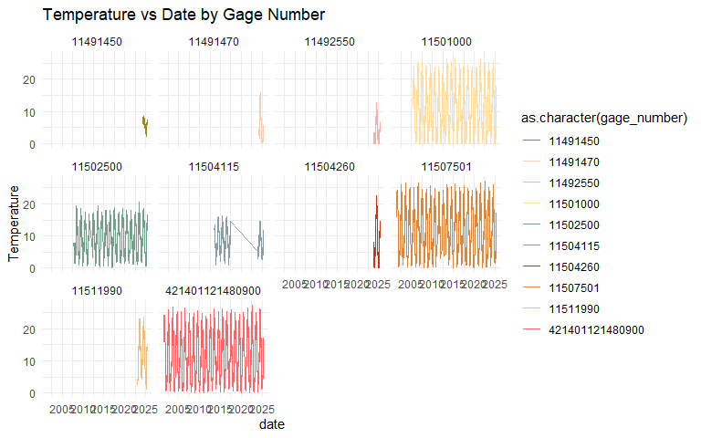
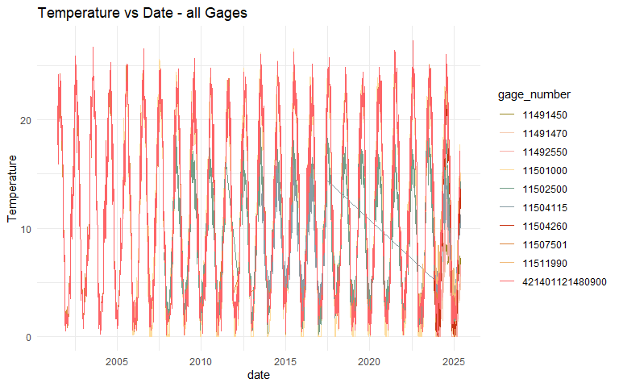

Klamath Basin Temperature Gage Exploration
================
Badhia Yunes Katz - FlowWest

USGS Temperature gage exploration - Klamath River Basin

The goal of this markdown is to explore USGS temperature gages within
the Klamath Basin, understand their geographic and temporal coverage.

### Klamath Main Steam

- LINK RIVER AT KLAMATH FALLS, OR 11507500
- KLAMATH RIVER BLW JOHN C.BOYLE PWRPLNT, NR KENO,OR 11510700
- KLAMATH R NR KLAMATH CA 11530500
- KLAMATH R A ORLEANS 11523000
- KLAMATH RIVER AT KENO, OR 11509500
- KLAMATH RIVER ABOVE KENO DAM, AT KENO, OR 11509370
- KLAMATH RIVER ABV KENO DAM, AT KENO - BOTTOM 420741121554001
- KLAMATH STRAITS DRAIN NEAR HIGHWAY 97, OR 420451121510000
- KLAMATH STRAITS DRAIN ABOVE F-FF PUMPS, WORDEN, OR 420448121503100
- KLAMATH RIVER AT MILLER ISLAND BOAT RAMP, OR 420853121505500
- KLAMATH RIVER AT MILLER ISLAND BOAT RAMP-BOTTOM 420853121505501

### Date coverage

<!-- --><!-- -->

### Trinity

- TRINITY R AB NF TRINITY R NR HELENA CA 11526400
- TRINITY R A HOOPA CA 11530000

### Date coverage

<!-- --><!-- -->

### Klamath Upper Lake

- RATTLESNAKE POINT - RPT 422042121513100
- UPPER KLAMATH LAKE AT HOWARD BAY, OR 421935121551200
- MID-TRENCH - LOWER - MDTL 422305121553800
- MID-TRENCH - UPPER - MDTU 422305121553803
- SHOALWATER BAY - SHB 422444121580400
- MID-NORTH - LOWER - MDNL 422622122004000
- MID-NORTH - UPPER - MDNU 422622122004003
- WILLIAMSON RIVER OUTLET - WMR 422719121571400
- SEVENMILE CNL AT DIKE RD BR, NR KLAMATH AGENCY, OR 11504290

### Date coverage

<!-- --><!-- -->

### Lost River

- LOST RVR AT ANDERSON ROSE DVRSN DAM AT MALONE, OR 420037121334100
- LOST RVR BLW ANDERSON ROSE DVRSN DAM AT MALONE, OR 420036121333700
- LOST RIVER AT WILSON DAM, AT HENLEY, OR 420833121402000
- LOST R AT BR XING BLW HARPOLD DAM, NR BONANZA, OR 421010121271200
- LOST RIVER DIVERSION CHANNEL NR KLAMATH RIVER, OR 421015121471800
- LOST RIVER AT STATELINE ROAD, NR HATFIELD, CA 415954121312100

### Date coverage

<!-- --><!-- -->

### Other streams

- SPRAGUE RIVER NEAR CHILOQUIN, OR 11501000
- WILLIAMSON RIVER BLW SPRAGUE RIVER NR CHILOQUIN,OR 11502500
- WOOD RIVER NEAR KLAMATH AGENCY, OR 11504115
- FOURMILE CANAL NEAR KLAMATH AGENCY, OR 11504260
- KLAMATH R AB FALL C NR COPCO CA 11511990
- LINK RIVER BELOW KENO CANAL, NEAR KLAMATH FALLS,OR 11507501
- JACKSON CREEK NEAR LENZ, OR 11491470
- IRVING CREEK NEAR LENZ, OR 11491450
- LINK RIVER DAM 421401121480900
- SAND CREEK BLW SAND CREEK CANAL NR CHINCHALO, OR 11492550

### Date coverage

<!-- --><!-- -->

Save clean table
