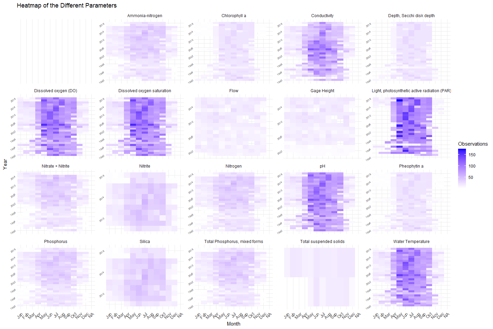
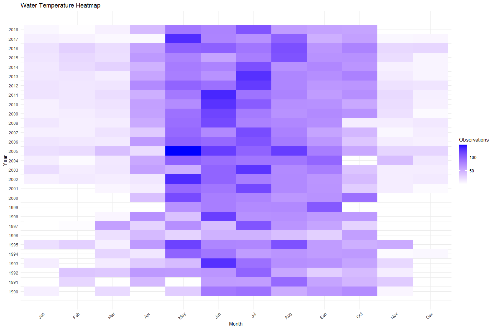
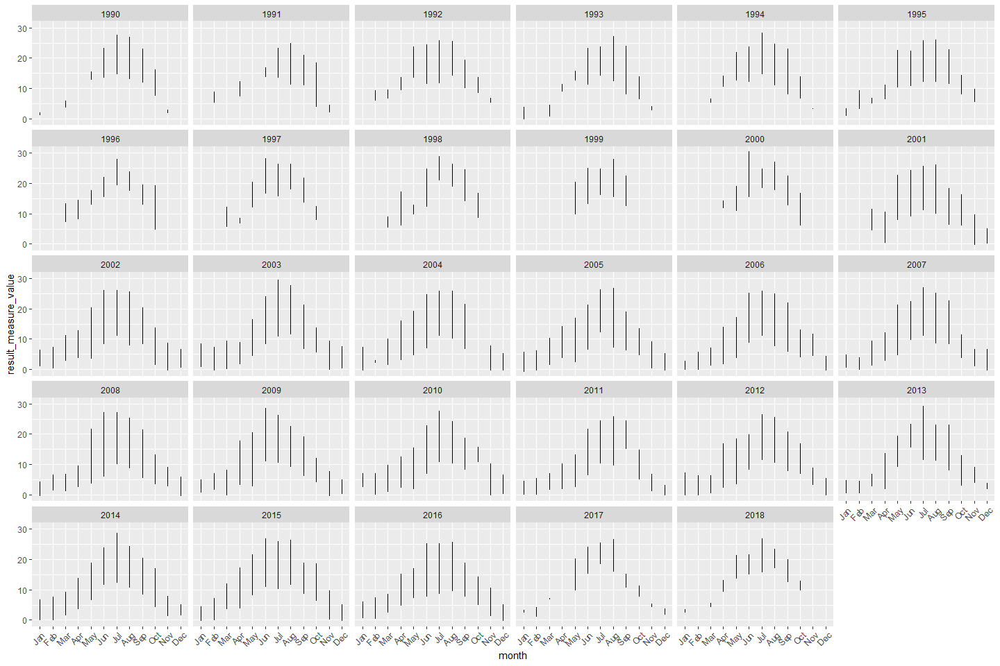
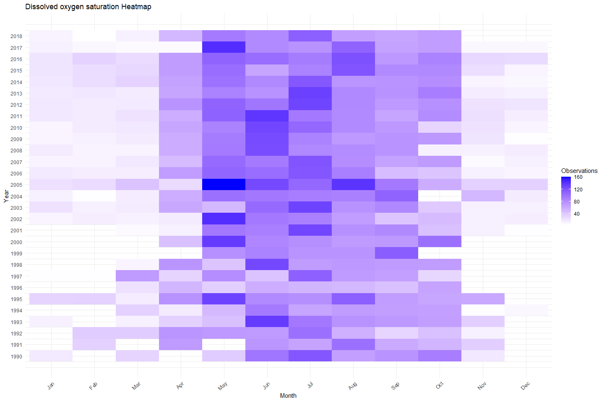
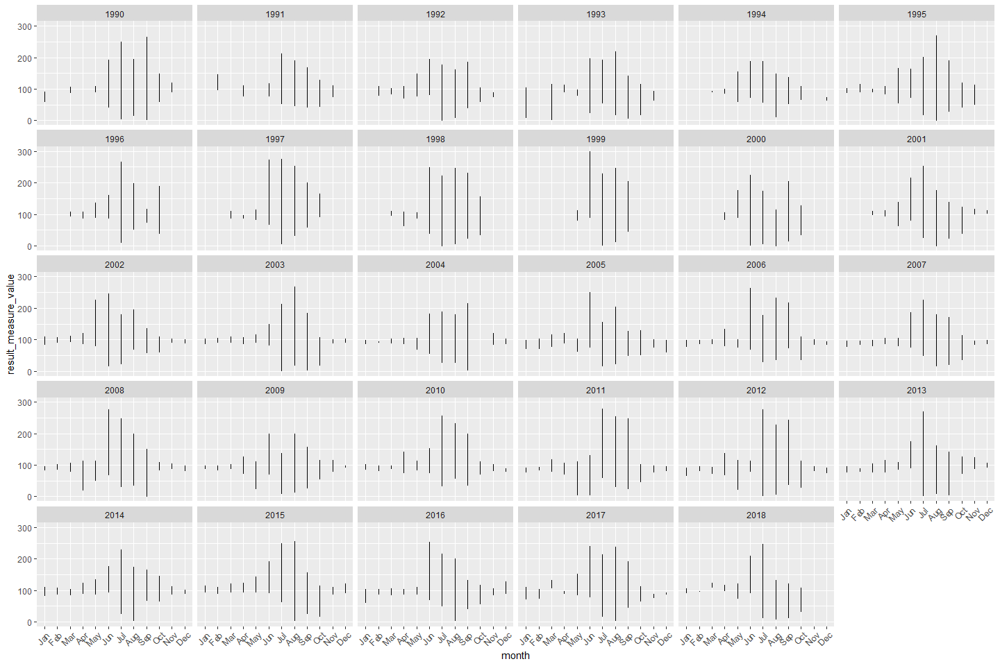
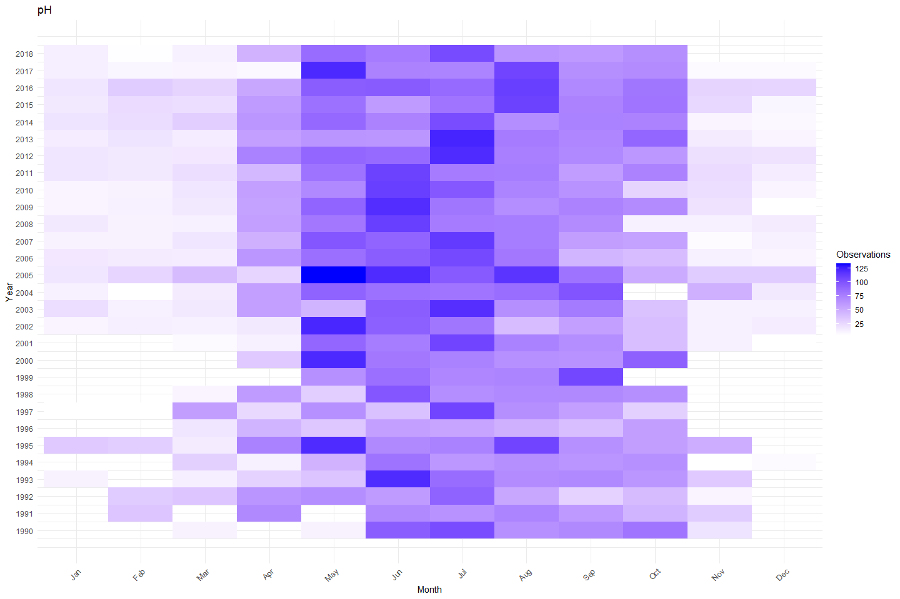
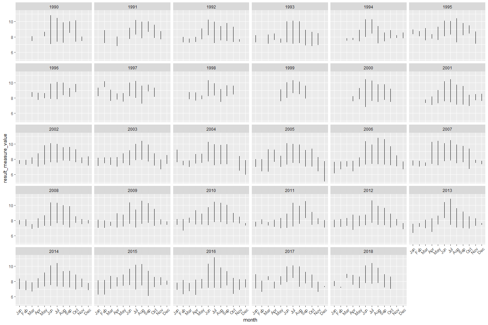

Klamath Tribes Water Quality Portal Data
================
Badhia Yunes Katz
January 2025

The purpose of this markdown is to give an overview of the dataset
including specific data types, temporal coverage, and geographic
coverage. This document is helpful in developing schemas to bring
together disparate datasets and exploring data limitations.

This data was downloaded from the [Klamath Tribes Water Quality
Portal](https://klamathtribeswaterquality.com/data/) and it is publicly
available.

### Overview

**Data type:**

When data is downloaded from portal it is in an excel file format.

## Data Available

- The monitoring program includes sampling water nutrients, water
  chemistry, algal toxins, and aquatic biota at up to 11 lake sites and
  water nutrients, water chemistry, and stream discharge at up to 20
  river and stream sites.

### Dataset

- Title: Klamath Tribes Water Quality Portal Data
- Spatial extent: Most data was collected on Upper Klamath Lake, and
  Sprague River. Data ranges from 1990 to 2018 with some data gaps up
  until year 2002. Noticeable gaps during 2017 and 2018
- Description: This data was collected by Klamath Tribes and contains
  different surface water parameters including:
  - Phosphorus
  - Dissolved oxygen saturation
  - pH
  - Light, photosynthetic active radiation (PAR)
  - Water Temperature
  - Dissolved oxygen (DO)
  - Silica
  - Ammonia-nitrogen
  - Total Phosphorus, mixed forms
  - Nitrogen
  - Conductivity
  - Nitrite
  - Chlorophyll a
  - Depth, Secchi disk depth
  - Pheophytin a
  - Nitrate + Nitrite
  - Total suspended solids
  - Gage Height
  - Flow
- Fields included: organization_identifier, organization_formal_name,
  activity_start_date, activity_start_time_time,
  activity_start_time_time_zone_code, monitoring_location_identifier,
  characteristic_name, subject_taxonomic_name, result_measure_value,
  result_measure_measure_unit_code, result_status_identifier,
  result_analytical_method_method_name, provider_name,
  monitoring_location_name, monitoring_location_type_name,
  huc_eight_digit_code, latitude_measure, longitude_measure
- Name of data file: `all_klamath_wqx_data.csv`

A breakdown of each of relevant parameters will be done below

**Data processing implications:**

All parameters are in the same file, these would need to be filtered to
be analyzed more in detail

#### Data summary

    ## `summarise()` has grouped output by 'year', 'month'. You can override using the
    ## `.groups` argument.

<!-- -->

### Temperature

    ## `summarise()` has grouped output by 'year'. You can override using the
    ## `.groups` argument.

<!-- -->

<!-- -->

### Dissolved oxygen saturation

- DO data ranges from 1990 to 2018 with some data gaps up until year
  2002

<!-- -->

    ## `summarise()` has grouped output by 'year'. You can override using the
    ## `.groups` argument.

<!-- --><!-- -->

### pH

    ## `summarise()` has grouped output by 'year'. You can override using the
    ## `.groups` argument.

<!-- --><!-- -->

## Save data

Data files are stored on AWS
